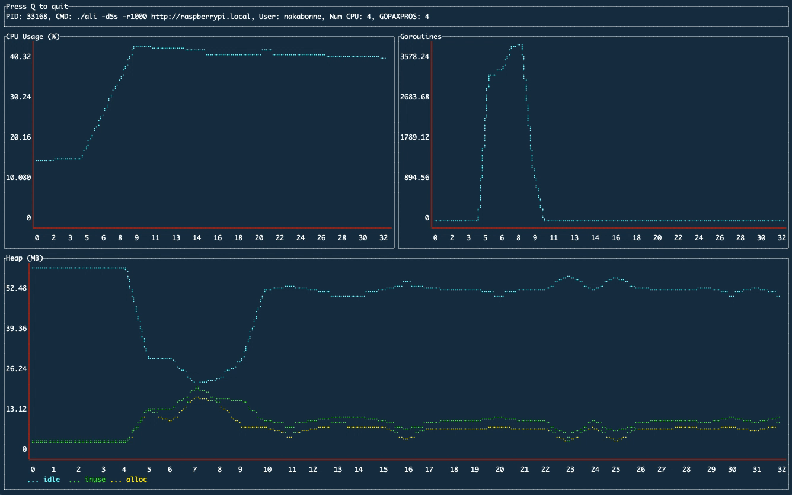

# gosivy
[](https://github.com/nakabonne/gosivy/releases/latest)
[](https://pkg.go.dev/mod/github.com/nakabonne/gosivy?tab=packages)

Another visualization tool for Go process metrics.



Gosivy tracks Go process's metrics and plot their evolution over time right into your terminal, no matter where it's running on. It helps you understand how your application consumes the resources.

## Installation
Binary releases are available through [here](https://github.com/nakabonne/gosivy/releases).

#### MacOS

```
brew install nakabonne/gosivy/gosivy
```

#### RHEL/CentOS

```
rpm -ivh https://github.com/nakabonne/gosivy/releases/download/v0.1.0/gosivy_0.1.0_linux_amd64.rpm
```

#### Debian/Ubuntu

```
wget https://github.com/nakabonne/gosivy/releases/download/v0.1.0/gosivy_0.1.0_linux_amd64.deb
apt install ./gosivy_0.1.0_linux_amd64.deb
```

#### Go
Required: >= 1.10
```
go get github.com/nakabonne/gosivy
```

## Quickstart
Unsure if Gosivy is for you? Watch Gosivy by using [the example application](https://github.com/nakabonne/gosivy/blob/main/examples/local/main.go).

Run the example application:
```
git clone https://github.com/nakabonne/gosivy.git && cd gosivy
go run examples/local/main.go
```

Then simply perform `gosivy` with no arguments (it automatically finds the process where the agent runs on):
```
gosivy
```

Press <kbd>q</kbd> to quit.

## Usage
First up, you start the agent in the process where you want to collect statistics. Then execute `gosivy` to scrape from the agent periodically. You can diagnose processes running not only locally (local mode), but also on another host (remote mode).

### Local Mode
Import `github.com/nakabonne/gosivy/agent` into the target application to launch the agent. See the [local example](https://github.com/nakabonne/gosivy/blob/main/examples/local/main.go).

```go
package main

import (
	"log"
	"time"

	"github.com/nakabonne/gosivy/agent"
)

func main() {
	if err := agent.Listen(agent.Options{}); err != nil {
		log.Fatal(err)
	}
	defer agent.Close()
}
```

With `-l` flag can list the processes where the agent runs on:
```console
$ gosivy -l
PID   Exec Path
15788 foo  /path/to/foo
```

Give the PID of the process to be diagnosed:
```
$ gosivy 15788
```

Be sure to start the `gosivy` process as the same user as the target application.

### Remote Mode
Give the address the agent listens on:
```go
package main

import (
	"log"
	"time"

	"github.com/nakabonne/gosivy/agent"
)

func main() {
	err := agent.Listen(agent.Options{
		Addr: "127.0.0.1:9090",
	})
	if err != nil {
		log.Fatal(err)
	}
	defer agent.Close()
}
```

Specify the target's agent address accessible by the host where `gosivy` will be executed:
```
$ gosivy host.xz:9090
```

### Settings
Command-line options are:

```
Usage:
  gosivy [flags] <pid|host:port>

Flags:
      --debug                      Run in debug mode.
  -l, --list-processes             Show processes where gosivy agent runs on.
      --scrape-interval duration   Interval to scrape from the agent. It must be >= 1s (default 1s)
  -v, --version                    Print the current version.
```

Gosivy requires the config directory for pid management. By default it will be created undernearth `$HOME/.config` (`APPDATA` on windows). For those who want to assign another directory, `GOSIVY_CONFIG_DIR` environment variable is available.

## Features

- **Simple** - Show only minimal metrics.
- **Pull-based monitoring** - The agent is designed to just listen on, so the target process does nothing unless you issue a request.
- **Wherever it's running on** - Any process can be diagnosed as long as you can access the TCP socket the agent opens.

## Supported Architectures
The architectures the agent can perform on are:

- Darwin i386/amd64
- Linux i386/amd64/arm(raspberry pi)
- FreeBSD i386/amd64/arm
- Windows/amd64
- OpenBSD amd64
- Solaris amd64

Those partially supported:
- CPU on DragonFly BSD
- host on Linux RISC-V

## Built With
- [shirou/gopsutil](https://github.com/shirou/gopsutil)
- [mum4k/termdash](https://github.com/mum4k/termdash)
  - [nsf/termbox-go](https://github.com/nsf/termbox-go)

## Inspired By
- [google/gops](https://github.com/google/gops)
- [arl/statsviz](https://github.com/arl/statsviz)


## Author
Ryo Nakao <<ryo@nakao.dev>>
